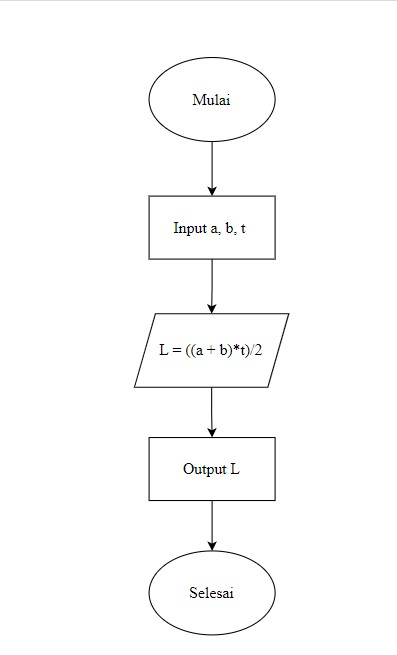

# Summary

1. Algoritma adalah prosedur komputasi yang didefinisikan dengan baik yang mengambil nilai sebagai input lalu diproses dan menghasilkan nilai sebagai output

<br>

2. Karakteristik algoritma ada 3 yaitu : 
   * Memiliki batas (awal dan akhir) 
   * Intruksi terdefinisikan dengan baik 
   * Efektif dan efisien

<br>

3. Algoritma memiliki 3 konsep utama yaitu
   * Sequential
   * Branching
   * Looping

<br>

4. ada dua cara untuk mempresentasikan algoritma yaitu: 
   * Pseudocode
   * Flowchart

<br>

# Introduction to Algorithm and Golang

## Algoritma
Algoritma adalah prosedur komputasi yang didefinisikan dengan baik yang mengambil beberapa nilai sebagai input dan menghasilkan beberapa nilai sebagai output. 

Contoh algoritma yaitu :
1. Cek bilangan prima
2. Sorting
3. Searching

Karakteristik algoritma yaitu :
1. Memiliki batas(awal dan akhir)
2. Instruksi terdefinisi dengan baik
3. Efektif & efisien

Jenis-jenis algoritma yaitu :
1. Sequential
2. Branching
3. Looping

## Pseudocode
Pseudocode adalah deskripsi dari algoritma pemrograman yang dibuat dengan tujuan agar mudah dibaca dan dipahami oleh manusia.

Contoh pseudocode menghitung luas segitiga :
```
INPUT Alas and Tinggi
CALCULATE Luas = (Alas * Tinggi) / 2
PRINT Luas
```

## Flowchart 
Flowchart adalah suatu bagan dengan simbol tertentu yang menggambarkan urutan dan hubungan antar proses secara mendetail.

Contoh flowchart :

